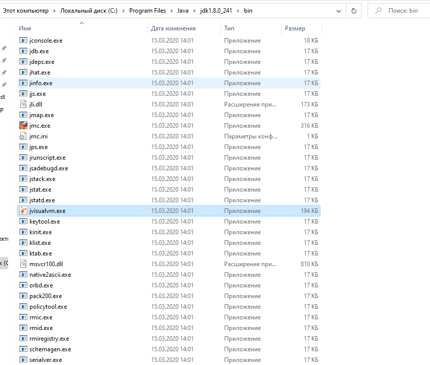
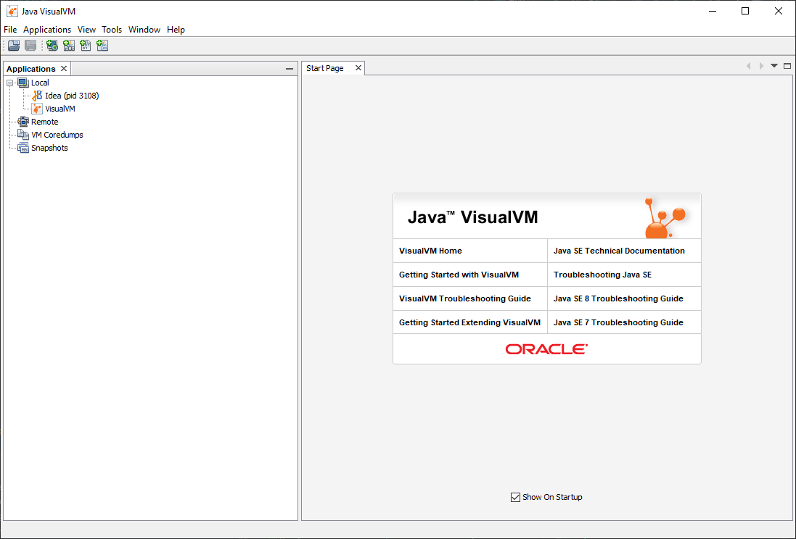
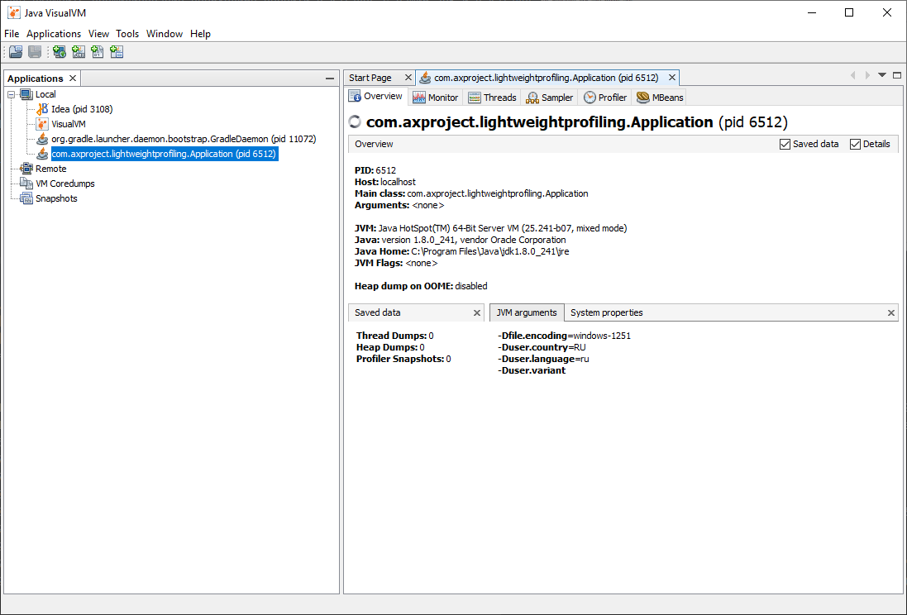
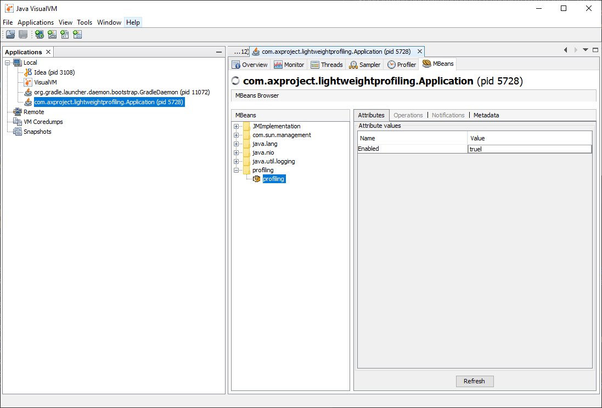
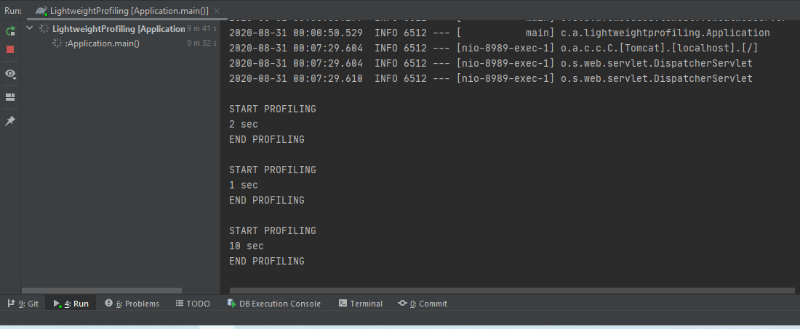

# Lightweight Profiling

Данный проект служит для демонстрации возможностей Spring Framework создавать и 
обрабатывать пользовательские аннотации.
Были реализованы аннотации для профилирования класса (все входящие в него методы), а также 
аннотация для профирования отдельного метода в проекте. 

## Использование

Используйте аннотацию [@ProfileClass]() для профилирования всего класса.
Данная аннотация указывается над объявлением класса.

```java
@ProfileClass
@Component
public class ProfilingClassComponentImpl implements Profiling {

}
```

Используйте аннотацию [@ProfileMethod]() для профилирования отдельного метода.
Данная аннотация указывается над объявлением метода.

```java
@ProfileMethod
public void lowProfiling() {

}
```

## Включение/Отключение профилирования в VirtualVM
Изначально профилирование в проекте отключено.
Чтобы включить профилирование необходимо перейти в каталог с вашим JDK, и в каталоге bin запустить приложение jvisualvm.





После запуска проекта в списке локальных приложений должен появиться PID еашего приложения.
предварительно требуется установить специальный плагин: Tools - Plugins - VisualVM-MBeans.



Выбираем вкладку MBeans, переходим в каталог profiling и меняем флаг на значение true или false в зависимости от того,
нужно ли нам профилирование или нет.



Лог при профилировании выглядит таким образом:



## Web приложение для профилирования

Перейдите по ссылке http://localhost:8989/ , чтобы протестировать профилирование. 